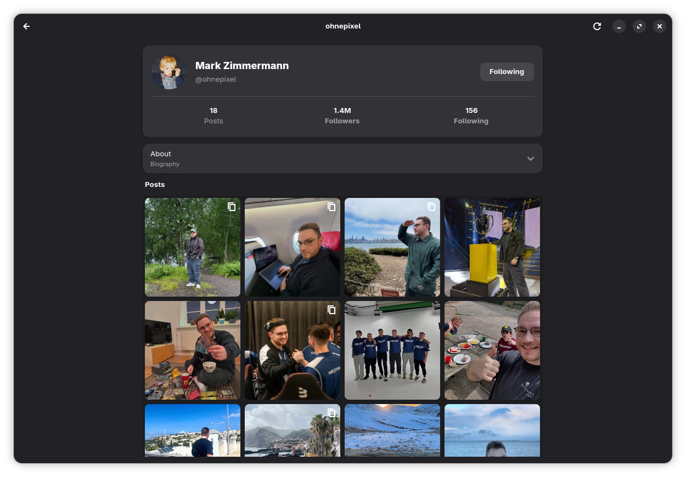

<div align="center">


# Viewfinder

Viewfinder is a program for the GNOME desktop. Viewfinder is an unofficial Instagram client.

</div>

Viewfinder is not affiliated with Instagram or Meta. We are not responsible for any account suspensions or terminations.




## Function

Viewfinder can do these tasks:

- Sign in through an embedded login window.
- Browse the feed, profiles, Reels, and Stories.
- Search for accounts and posts.
- Like, follow, comment, and send messages.

## Start Viewfinder

The computer must have GTK 4.18 or a subsequent version, libadwaita 1.7 or a subsequent version, WebKitGTK 6.0, and GStreamer with the GTK 4 paintable sink.

```sh
cargo run
```

## Flatpak

Viewfinder can be built and installed as a Flatpak from this repository. The sandbox has network access for sign-in and media, and it stores the session with the system keyring.

```sh
flatpak-builder --user --install --force-clean --install-deps-from=flathub \
  flatpak-build io.github._6E6B.viewfinder.yml
flatpak run io.github._6E6B.viewfinder
```

If a native Viewfinder process is already running, GTK will activate that window instead of opening a second copy. Quit the native build first when you want to test the Flatpak.

## License

GNU General Public License, version 3.0 or a subsequent version. See [LICENSE](LICENSE).
